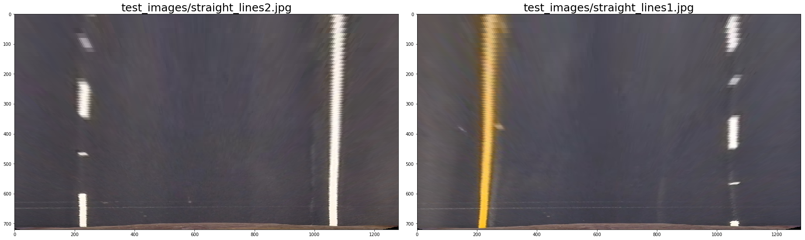

## Writeup 

---

**Advanced Lane Finding Project**

The goals / steps of this project are the following:

* Compute the camera calibration matrix and distortion coefficients given a set of chessboard images.
* Apply a distortion correction to raw images.
* Use color transforms, gradients, etc., to create a thresholded binary image.
* Apply a perspective transform to rectify binary image ("birds-eye view").
* Detect lane pixels and fit to find the lane boundary.
* Determine the curvature of the lane and vehicle position with respect to center.
* Warp the detected lane boundaries back onto the original image.
* Output visual display of the lane boundaries and numerical estimation of lane curvature and vehicle position.

[//]: # (Image References)

[image1]: ./examples/undistort_output.png "Undistorted"
[image2]: ./test_images/test1.jpg "Road Transformed"
[image3]: ./examples/binary_combo_example.jpg "Binary Example"
[image4]: ./examples/warped_straight_lines.jpg "Warp Example"
[image5]: ./examples/color_fit_lines.jpg "Fit Visual"
[image6]: ./examples/example_output.jpg "Output"
[video1]: ./project_video.mp4 "Video"

## [Rubric](https://review.udacity.com/#!/rubrics/571/view) Points

### Here I will consider the rubric points individually and describe how I addressed each point in my implementation.  

---

### Camera Calibration

#### 1. Briefly state how you computed the camera matrix and distortion coefficients. Provide an example of a distortion corrected calibration image.

The code for the camera calibration is contained in [01_Camera_Calibration.ipynb](01_Camera_Calibration.ipynb)

I start by preparing "object points", which will be the (x, y, z) coordinates of the chessboard corners in the world. The object points will always be the same as the known coordinates of the chessboard with zero as 'z' coordinate because the chessboard is flat.  Thus, `objp` is just a replicated array of coordinates, and `objpoints` will be appended with a copy of it every time I successfully detect all chessboard corners in a test image. `imgpoints` will be appended with the (x, y) pixel position of each of the corners in the image plane with each successful chessboard detection.  

I then used the output `objpoints` and `imgpoints` to compute the camera calibration and distortion coefficients using the `cv2.calibrateCamera()` function. I applied this distortion correction to the test image using the `cv2.undistort()` function and obtained this result: 


The camera calibration and distortion coefficients are stored using `pickle` for later use [camera_calibration.p](camera_cal/camera_calibration.p).


### Pipeline (single images)

The code for the image pipeline is contained in [02_Pipeline_Images.ipynb](02_Pipeline_Images.ipynb)

#### 1. Provide an example of a distortion-corrected image.

To demonstrate this step, I will describe how I apply the distortion correction to one of the test images like this one. The camera calibration and distortion coefficients was loaded with the `pickle` module. I applied this distortion correction to the test image using the `cv2.undistort()` function and obtained this result: 


#### 2. Describe how (and identify where in your code) you used color transforms, gradients or other methods to create a thresholded binary image.  Provide an example of a binary image result.

I used a combination of color and gradient thresholds to generate a binary image. The code used to experiment with color spaces, gradients, and thresholds can be found on the [02_Thresholded_Binary_Image.ipynb](02_Thresholded_Binary_Image.ipynb).

A color transformation to HLS with min_tresh=170 and max_tresh=255 was done `In [8]` and the S channel was selected because it is cleaner than the H channel result and a bit better than the R channel or simple grayscaling. Furthermore the S channel is still doing a fairly robust job of picking up the lines under very different color and contrast conditions.


After the color transformation had been done, it was time for gradients. The following gradients were calculated:

- Gradient Sobel X: `In [10]` and `In [11]` with min_tresh=10, max_tresh=120, kernel_size=9 


- Gradient Sobel Y: `In [10]` and `In [12]` with min_tresh=10, max_tresh=120, kernel_size=9 


- Gradient Magnitude : `In [13]` and `In [14]` with min_tresh=10, max_tresh=120, kernel_size=9 


- Gradient Direction : `In [15]` and `In [16]` with min_tresh=0.7, max_tresh=1.3, kernel_size=11


- Combination of Sobel X and Sobel Y: `In [17]` 


- Combination of all the above (Sobel X and Sobel Y) or (Magnitude and Gradient): `In [18]`


- Combination of S channel and Sobel X: `In [19]` and `In [20]`


After a some experiments with different thresholds, kernel sizes and combinations, I decided to take the combination (OR) of S channel and Sobel x (Gradient in x direction emphasizes edges closer to vertical) to create the binary image. Especially the loss in the curve line is the lowest here.


#### 3. Describe how (and identify where in your code) you performed a perspective transform and provide an example of a transformed image.

The perspective transformation code could be found on [03_Perspective_Transform.ipynb](03_Perspective_Transform.ipynb). The images used were the one with straight lane lines.

Four points where selected as the source of the perspective transformation. Those points are highlighted on the following image (`In [8-10]`):


The destination points for the transformation where to get a clear picture of the street:

```python
src = np.float32(
    [[(img_size[0] / 2) - 65, img_size[1] / 2 + 100],
    [((img_size[0] / 6) - 25), img_size[1]],
    [(img_size[0] * 5 / 6) + 60, img_size[1]],
    [(img_size[0] / 2 + 65), img_size[1] / 2 + 100]])

dst = np.float32(
    [[(img_size[0] / 4), 0],
    [(img_size[0] / 4), img_size[1]],
    [(img_size[0] * 3 / 4), img_size[1]],
    [(img_size[0] * 3 / 4), 0]])
```

This resulted in the following source and destination points:

| Source        | Destination   | 
|:-------------:|:-------------:| 
| 575, 460      | 320, 0        | 
| 188, 720      | 320, 720      |
| 1127, 720     | 960, 720      |
| 705, 460      | 960, 0        |


Using `cv2.getPerspectiveTransform`, a transformation matrix was calculated (`In [11]`). The result of the transformation:




#### 4. Describe how (and identify where in your code) you identified lane-line pixels and fit their positions with a polynomial?

Then I did some other stuff and fit my lane lines with a 2nd order polynomial kinda like this:

![alt text][image5]

#### 5. Describe how (and identify where in your code) you calculated the radius of curvature of the lane and the position of the vehicle with respect to center.

I did this in lines # through # in my code in `my_other_file.py`

#### 6. Provide an example image of your result plotted back down onto the road such that the lane area is identified clearly.

I implemented this step in lines # through # in my code in `yet_another_file.py` in the function `map_lane()`.  Here is an example of my result on a test image:

![alt text][image6]

---

### Pipeline (video)

#### 1. Provide a link to your final video output.  Your pipeline should perform reasonably well on the entire project video (wobbly lines are ok but no catastrophic failures that would cause the car to drive off the road!).

Here's a [link to my video result](./project_video.mp4)

---

### Discussion

#### 1. Briefly discuss any problems / issues you faced in your implementation of this project.  Where will your pipeline likely fail?  What could you do to make it more robust?

Here I'll talk about the approach I took, what techniques I used, what worked and why, where the pipeline might fail and how I might improve it if I were going to pursue this project further.  
